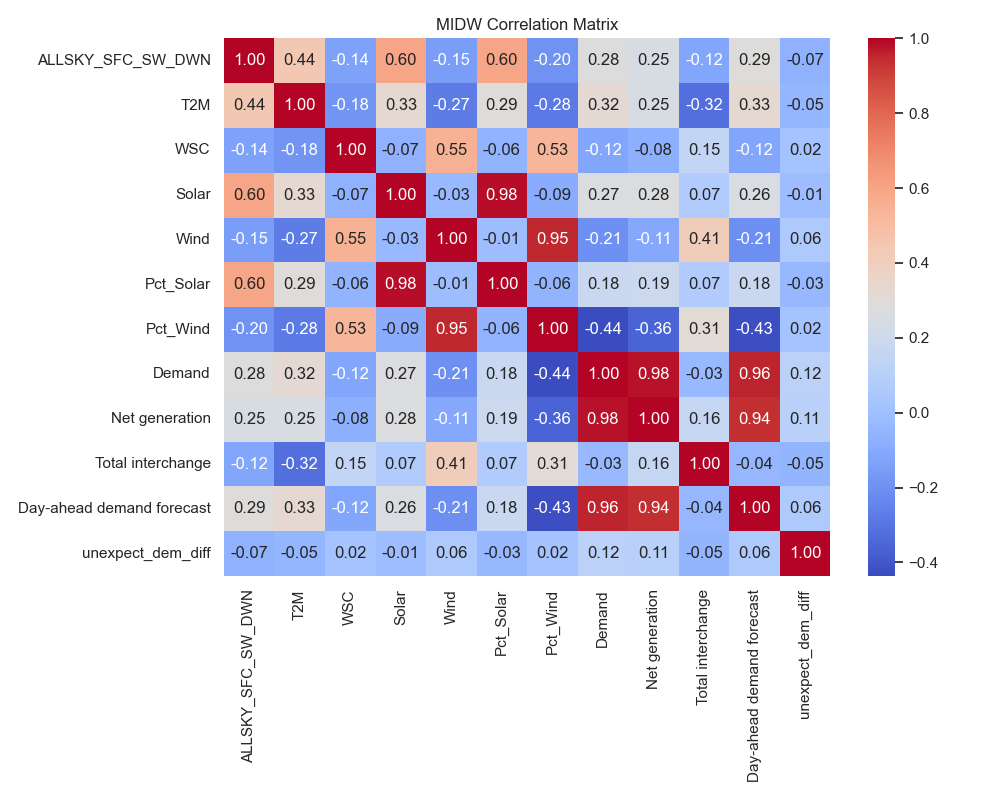
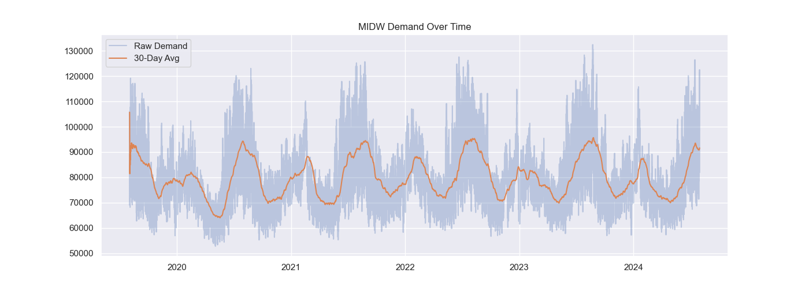
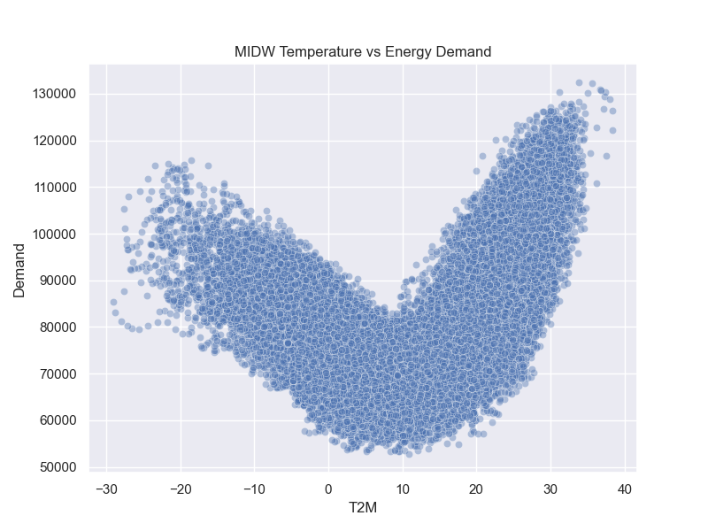
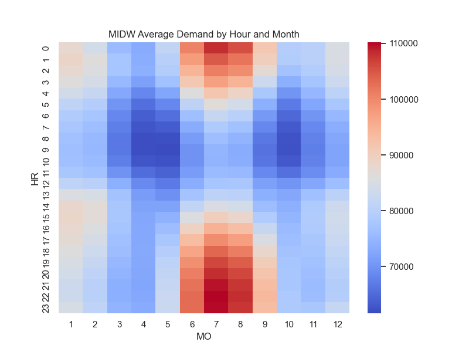
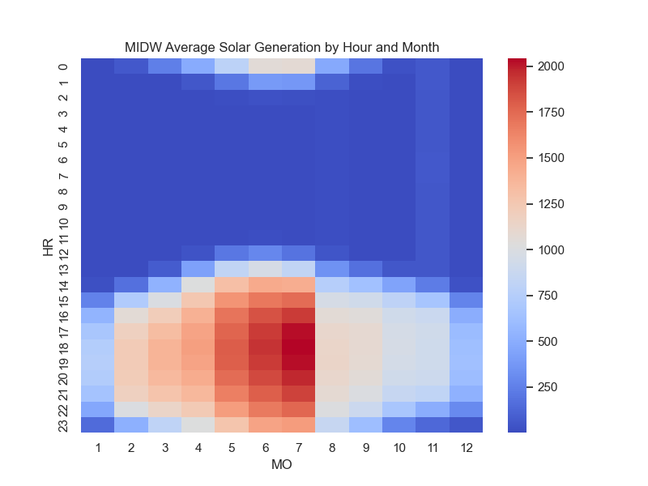
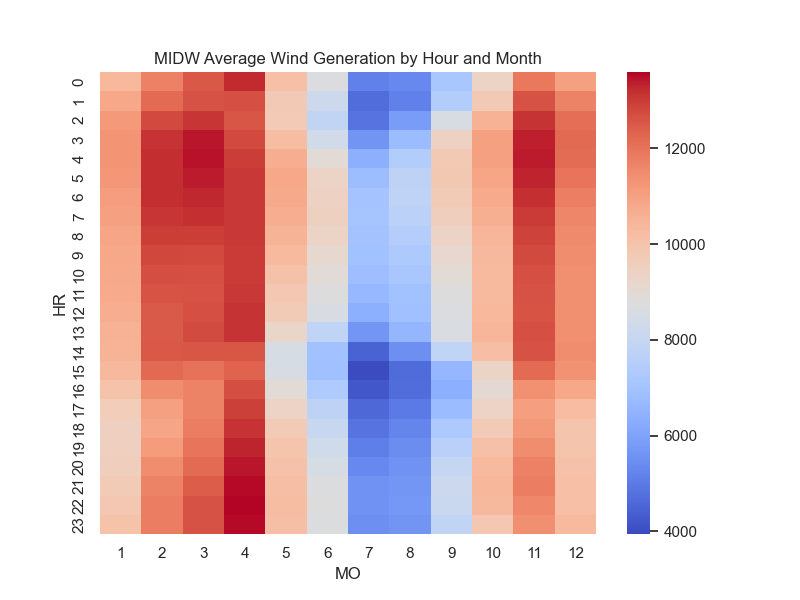
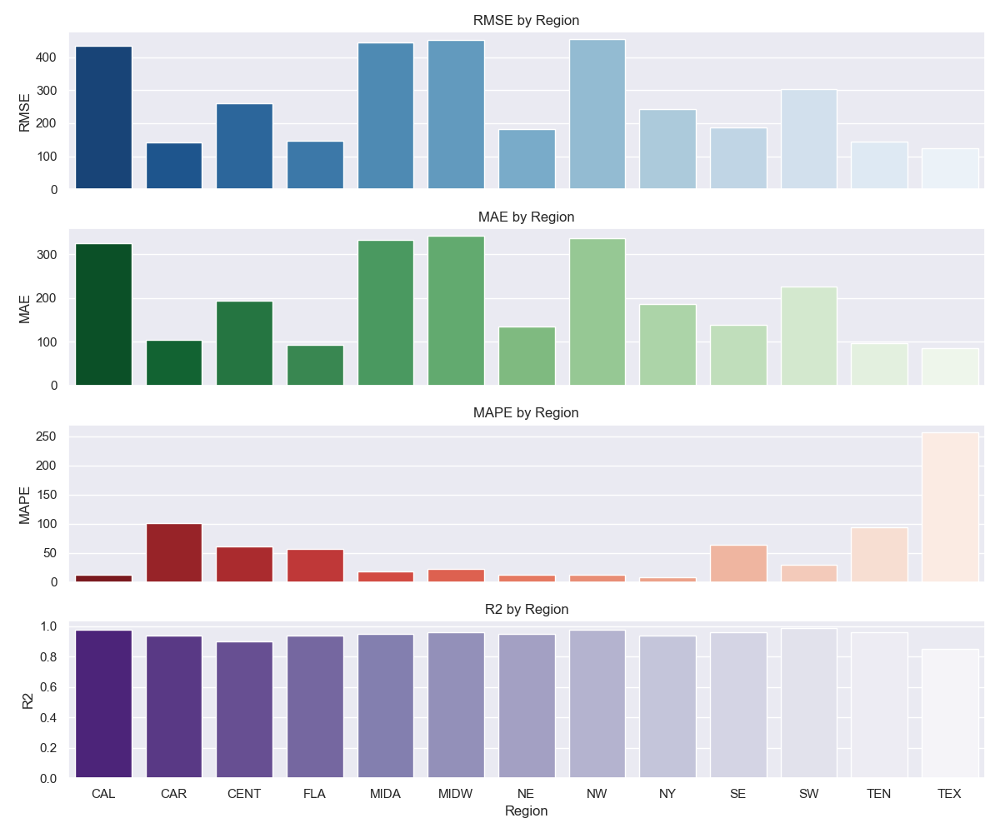
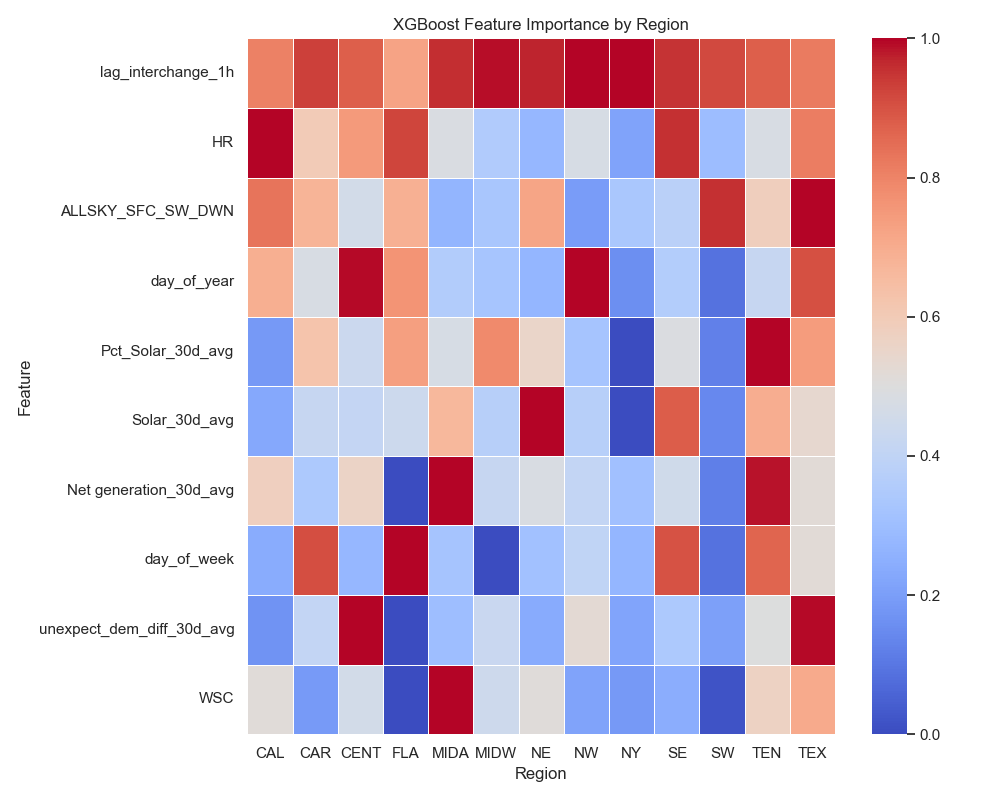

# ML Analysis of Renewable Energy Demand and Weather Supply

This project analyzes U.S. energy demand and renewable energy supply (solar and wind) using machine learning. It aligns 
weather and demand data to identify underserved regions with investment potential.

## Goal
- Merge and align hourly weather, solar/wind generation, and demand data
- Identify temporal and geographic mismatches
- Use clustering and predictive models to support planning for solar/wind investment

## Setup
To get a local copy of the project:

### 1. Clone the repository
```bash
git clone https://github.com/mhorns/ML-Analysis-of-Renewable-Energy-Demand-and-Weather-Supply.git
cd ML-Analysis-of-Renewable-Energy-Demand-and-Weather-Supply
```

### 2. Create and activate a virtual environment
```bash
python -m venv venv
# On Windows:
venv\Scripts\activate
# On macOS/Linux:
source venv/bin/activate
```

### 3. Install required packages
```bash
pip install -r requirements.txt
```

### 4. Run sample pipeline
```bash
make all # runs sample or 'full' which creates whole pipeline over 40 minutes of downloads
```

## Data

[US Energy Information Administration](https://www.eia.gov/opendata/)
[NASA - The POWER Project](https://power.larc.nasa.gov/)

Two API are used for the above data in addition to scraping Wikipedia tables to gather coordinates to pass to NASA.  
Examples for New York are below.

```python
# Read all tables from the page
url = "https://en.wikipedia.org/wiki/List_of_largest_cities_of_U.S._states_and_territories_by_population"
tables = pd.read_html(url)

# Get list of largest cities
cities_df = tables[1]
```

We access the EIA API and data the electricity data per below.

```python
url = "https://api.eia.gov/v2/electricity/rto/region-data/data/"
params = {
    "frequency": "hourly",
    "data[0]": "value",
    "facets[respondent][]": "NY",
    "start": "2024-01-01T00",
    "end": "2024-07-31T00",
    "sort[0][column]": "period",
    "sort[0][direction]": "desc",
    "offset": 0,
    "length": 5000,
    "api_key": "YOUR_KEY"
}

response = requests.get(url, params=params)
json_data = response.json()

eia1_df = pd.DataFrame(json_data['response']['data'])
```

```text
period respondent respondent-name type type-name value value-units 
2024-07-31 00:00:00 NY New York D Demand 26508 megawatthours 
2024-07-31 00:00:00 NY New York DF Day-ahead demand forecast 25158 megawatthours 
2024-07-31 00:00:00 NY New York NG Net generation 24555 megawatthours 
2024-07-31 00:00:00 NY New York TI Total interchange -1953 megawatthours 
2024-07-30 23:00:00 NY New York D Demand 27352 megawatthours 
```

And NASA POWER data using the Wikipedia obtained coordinates for NYC.

```python
url = "https://power.larc.nasa.gov/api/temporal/hourly/point"
params = {
    "start": "20240101",
    "end": "20240731",
    "latitude": 40.78,
    "longitude": -73.87,
    "community": "re",
    "parameters": "ALLSKY_SFC_SW_DWN,T2M,WSC",
    "wind-elevation": 100,
    "wind-surface": "airportgrass",
    "format": "csv",
    "header": "true",
    "time-standard": "utc"
}

response = requests.get(url, params=params)
response.raise_for_status()
csv_data = StringIO(response.text)
environ_df = pd.read_csv(csv_data, skiprows=14)  # Skip metadata rows
```

```text
YEAR  MO  DY  HR  ALLSKY_SFC_SW_DWN   T2M   WSC
2024   1   1   0                0.0  1.76  3.72
2024   1   1   1                0.0  1.27  3.48
2024   1   1   2                0.0  1.31  3.03
2024   1   1   3                0.0  1.52  2.55
2024   1   1   4                0.0  1.71  2.26
```

These files are then merged together by the date time to make a wide table for usage in EDA and model training.  More 
granular details on the merging and feature engineering are contained in the code and described later as part of 
Exploratory Data Analysis.

## Running The Code

The code can be run via a Make file.  At present there are three files: (1) gathers the data from EIA.gov and NASA.gov,
(2) performs some Exploratory Data Analysis and generates from interesting graphics for each region, (3) performs some 
model fitting for the regional data to execute a grid search for best model parameters for XGBoost on the compiled data.

## Methods

Our target variable for modeling is the "Total Interchange", the amount one region exceeds or fails to meet the energy 
demand with its current hourly supply.  That amount is borrowed from other areas of the grid and a deficit increases 
prices paid during peak hours.  Our goal is to model each region and see which areas can benefit by more investment in 
wind and solar (without factoring in costs or policy framework).  We will model and predict the total interchange for 
each region, then using weather data attempt to predict how more generation from wind and solar may balance the region 
of the grid.  We will use XGBoost, LSTM, GRU, and autoencoders to train and fit the total interchange.  We then will use 
the weather data to compare regions the possibility of wind and solar generation figures on a system-wide basis.  We then 
will inject those figures into our model to see if the prediction of the total interchange for a given region becomes 
more balanced.


## Status

In progress.  Data generation, preprocessing and EDA complete.  XGBoost model has been implemented with some preliminary 
results.  


## Analysis

### Data Collection
The gathering of the data can be quite time-consuming as both the EIA and NASA API usage has requirements to batch data.  
For EIA we are batching 5,000 hourly observations at a time and for NASA we are gathering 6 months at a time.  The API 
are slow with each taking over 40 minutes to compile all regional data.  In particular, the NASA API can time out and 
require retires after a cool-off period, which are build into the code.

### Exploratory Data Analysis
We can see during EDA there are some interesting interactions with the total interchange variable.  We can see there are 
some very highly correlated features and this is due to information leakage.  We will need to remove demand since it is 
a direct component of total interchange.  Total interchange = Net Generation - Demand.  For something like day ahead demand, 
we will be introducing lagged variables in order to capture the change and unexpected differences.  



We also need to account for seasonality over time.  We will introduced 30 day rolling average variables in addition to the 
rolling window lags.  For many regions summer is hot and winter is cold.  At both extremes demand spikes




We are also able to see that the peak demand times by month occur at a time when the sun is shining, making a great case 
for solar.  Firthermore, we can see that during winter time demand spikes, wind is a good alternative.






### Machine Learning Model Implementation
After training XGBoost for each region using cross validation based on a train/test split of 4years/1year, we have been 
able to observe there are some large regional variations in the model metrics.  This is likely due to idiosyncrasies in 
each region's power generation relating to proportion of renewables, temperature variation over the year, and ability to 
meet its own demand. Feature importance for each region also shows some divergent patterns likely due to the same factors. 







## Future Considerations

### Contributors

[Mitchell Hornsby](https://github.com/mhorns)